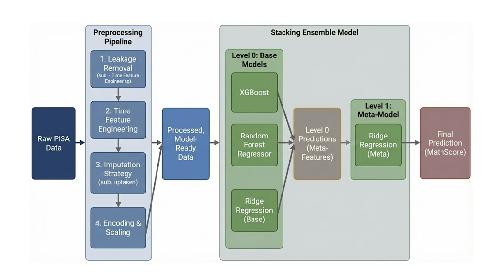

# Hi! PARIS Hackathon - PISA MathScore Prediction & Motiva'Class

<p align="center">

</p>

Date: November 28 – December 1, 2025 (Final Sprint)

Location: ENSTA, Palaiseau

Role : Data Scientist, Product Designer

Associated with : HEC Paris, Institut Polytechnique de Paris

Organizers : Hi! PARIS

Corporate Partners : L'Oréal, Capgemini, TotalEnergies, VINCI, Schneider Electric

Tools : Python, Scikit-Learn, XGBoost, Optuna

A comprehensive machine learning solution developed during the Hi! PARIS Hackathon - an intensive data science competition using PISA (Programme for International Student Assessment) datasets from 2018 and 2022. The project combines predictive modeling with data-driven product design to address student concentration and motivation challenges.

## The Team

**Team 46** - Interdisciplinary collaboration between HEC Paris and École Polytechnique:

* Gabriel Mercier - M2 Data Science, École Polytechnique
* Clément Destouesse - M2 Data Science, École Polytechnique  
* Jawad Chemaou - M2 Data Science, École Polytechnique
* Benoît Delaporte - MiF, HEC Paris
* Adèle Thomas - CPES2 Data Science, Université Paris-Saclay, HEC Paris, IP Paris
* Auréva Tagand-Baud - CPES2 Data Science, Université Paris-Saclay, HEC Paris, IP Paris

---

This repository includes:
* **Stacking ensemble model** (XGBoost, Random Forest, Ridge) achieving **R² = 0.75** on MathScore prediction
* **Custom preprocessing pipeline** with 7 specialized transformers handling extensive missing values (>50% for many features)
* **Business analysis notebooks** identifying 4 key motivation drivers through statistical validation
* **Motiva'Class**: An innovative hybrid physical/digital solution designed from data insights

---

## Project Overview

### The Challenge
Predict students' **MathScore** using:
* Responses to PISA questionnaires (sociodemographic, behavioral, contextual variables)
* Performance in other subjects (Reading, Science)
* Timing data across test sections

Design a data-driven solution to improve student concentration and motivation in classrooms.

### Our Approach

<p align="center">

</p>

**Part 1: Predictive Modeling**
* Developed a stacking ensemble combining XGBoost, Random Forest, and Ridge Regression
* Implemented 7 custom preprocessing transformers to handle extensive missing data
* Optimized hyperparameters using Optuna with Bayesian optimization
* Achieved **R² = 0.75**, explaining 75% of variance in math performance

**Part 2: Data-Driven Product Design**
* Constructed and validated a motivation proxy through statistical analysis (Spearman correlation: 0.19)
* Identified 4 actionable drivers: teacher-student relationship, real-world applications, home-school continuity (ST250), and digital usage
* Designed **Motiva'Class**, a hybrid solution where each feature directly addresses a validated data insight

---

## Model Architecture

### Stacking Ensemble Strategy
A two-level ensemble approach combining complementary models:

**Level 0 - Base Models:**
* **XGBoost** : Captures non-linear patterns and complex feature interactions
* **Random Forest** : Provides robustness to outliers and reduces variance
* **Ridge Regression** : Models linear trends and serves as a regularized baseline

**Level 1 - Meta-Model:**
* **Ridge Regression** : Learns optimal weights to combine base model predictions

**Training Configuration:**
* Cross-validation : 3-fold for stacking, 5-fold for hyperparameter optimization
* Optimization framework : Optuna with Bayesian search (100 trials per model)
* Evaluation metric : R² score
* Best parameters saved to JSON for reproducibility

---

## Data Processing Pipeline

Seven modular transformers following scikit-learn's API to handle the complex PISA dataset:

**1. RemoveMathColumns** : Prevents data leakage by removing math-related features except `math_q1_total_timing` (effort indicator)

**2. ProcessTimeColumns** 
```python
f(t) = 1 / log(t)  if t > 1 else 0
```
Addresses timing columns ranging up to 10^7 with NaN indicating incomplete sections. The transformation inverts the logic (0 = infinite time, high values = fast completion) while log-scaling extreme values.

**3. FillReadingScienceNaN** : Imputes missing Reading/Science scores with 0 (assumption: domain not tested)

**4. ColumnImputerByList** : Stratified imputation by variable type
* Zero-fill for absent scores
* Mean imputation for continuous variables  
* Mode imputation for categorical variables

**5. DropHighMissing** : Removes columns exceeding 30% missing values plus manual exclusions

**6. YesNoOtherEncoder** : Transforms binary columns into three features (`col_yes`, `col_no`, `col_other`) to capture "no response" information

**7. OHEncoding** : Maps PISA codes to semantic labels, creates derived features (parent occupations, language/nationality matches)

All transformers implement `fit()` on training data to prevent leakage during `transform()` on test data.

---

## Results

**Model Performance:** R² = 0.75 on test set (75% of variance explained)

**Top Features (XGBoost importance):**
1. ADMINMODE (test administration mode)
2. ST250 (home academic support during COVID) 
3. Reading/Science scores (cross-domain performance)

**Key Finding:** ST250's prominence validates the critical role of home-school learning continuity—a direct insight driving our solution design.

---

## Motiva'Class: Data-Driven Solution

### The Problem
Declining student concentration and motivation due to digital distractions, attention disorders, and disconnection from learning material.

### Our Solution
**Motiva'Class** is a hybrid physical/digital system designed from validated PISA insights.

**Physical Component (In-Class):**
* Challenge cards with real-world problems and clear deadlines
* Cooperative point system fostering classroom solidarity
* Personalized difficulty levels

**Digital Component (At-Home):**
* Learning objectives tailored to individual students
* Analytics dashboard for teachers
* Parent version ensuring home-school continuity

### Evidence-Based Design

| PISA Data Insight | Motiva'Class Feature | Expected Impact |
|-------------------|---------------------|-----------------|
| Real-world applications → higher motivation | Concrete, ongoing problem-based cards | Increased engagement with practical learning |
| Teacher-student relationship matters | Personalized exercise sets | Stronger classroom connection |
| **ST250: Home support is critical** | Family kit + parent app | Academic continuity beyond school hours |
| Cooperation enhances commitment | Collective points system | Improved solidarity and participation |

**Validation:** Spearman correlation of 0.19 between our motivation proxy and MathScore (statistically significant, p < 0.05)

---

## Getting Started

**Prerequisites:** Python 3.10+, pip

**1. Clone the repository:**
```bash
git clone https://github.com/Aureva21/Hi-PARIS-Hackathon-6---AI-and-Education.git
cd hiparis-pisa-hackathon
```

**2. Install dependencies:**
```bash
pip install -r requirements.txt
```

**3. Explore the notebooks:**
```bash
jupyter notebook model__1_.ipynb
```

**4. Train the model:**
```python
import pandas as pd
from pipeline import *
import json

# Load data and optimized hyperparameters
X_train = pd.read_csv('X_train.csv')
y_train = pd.read_csv('y_train.csv')

with open('study_xgb_best_params.json', 'r') as f:
    xgb_params = json.load(f)

# Build and train stacking model
# (See model__1_.ipynb for complete implementation)
```

---

## Why This Repository Matters

* **Demonstrates rigorous data science methodology** in a competitive environment with real-world messy data (>50% missing values)
* **Showcases end-to-end ML pipeline** from custom preprocessing to ensemble modeling and hyperparameter optimization
* **Bridges technical analysis and product design** through data-driven insights informing an actionable solution
* **Exemplifies team collaboration** across technical and business profiles (Data Science, Finance, CPES)

---

## Acknowledgments

* **Hi! PARIS** for organizing this impactful hackathon
* **PISA/OECD** for providing comprehensive educational assessment data
* Our team's dedication to combining technical rigor with real-world impact

---

## References

* [PISA Official Documentation](https://www.oecd.org/pisa/)
* [XGBoost Documentation](https://xgboost.readthedocs.io/)
* [Optuna: Hyperparameter Optimization Framework](https://optuna.org/)

---

*Developed by Team 46 at Hi! PARIS Hackathon*
